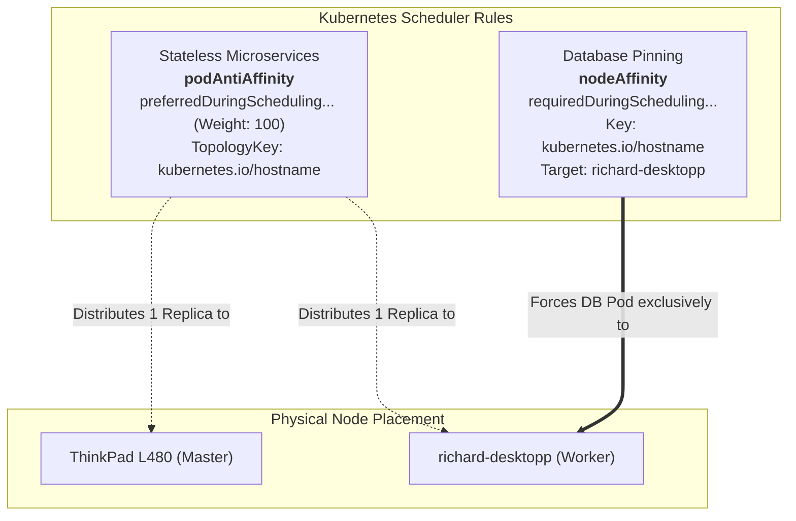
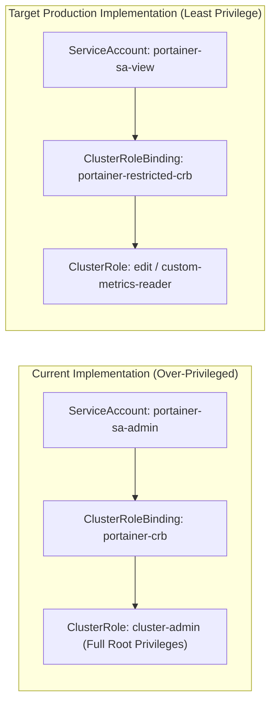
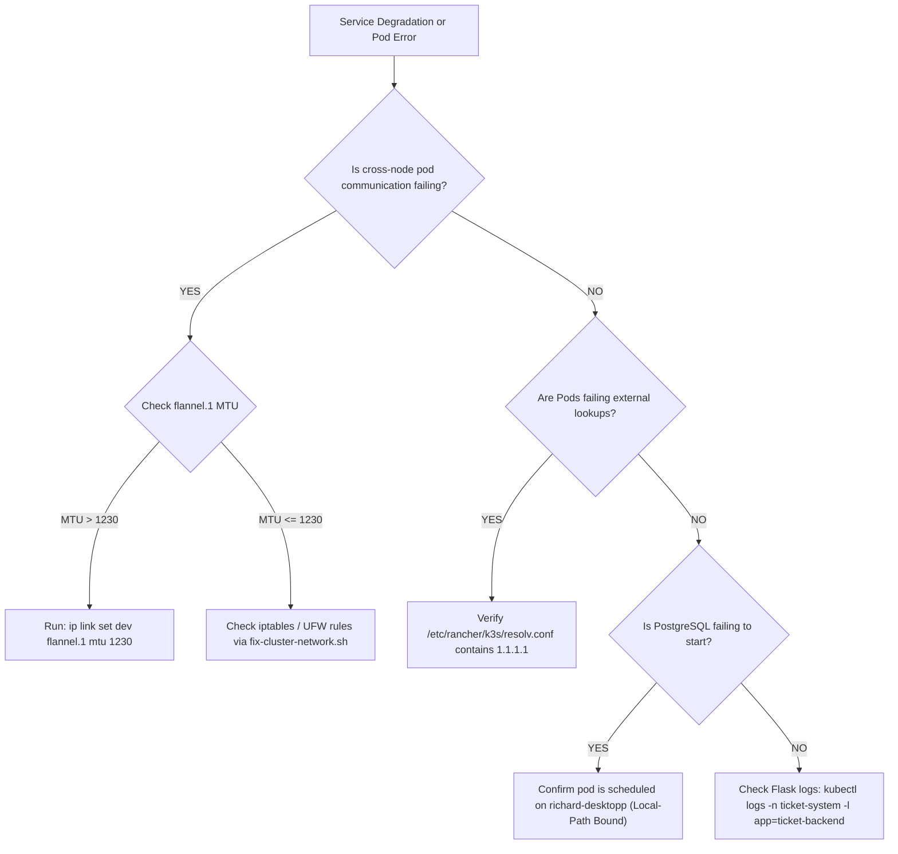

# Architecture & Engineering Reference: Full-Stack K3s Homelab Cluster

---

## 1. Executive Summary & System Overview

This document provides the definitive, production-grade architecture and engineering specification for the **full-stack-cluster**—a hybrid, multi-node [K3s](https://k3s.io) Kubernetes cluster deployed across bare-metal Arch Linux / EndeavourOS nodes interconnected via a secure [Tailscale](https://tailscale.com) WireGuard overlay mesh.

The infrastructure hosts a distributed microservice application stack (**Incident Ticket System**) along with an administrative control plane (**Portainer CE**).

```mermaid
graph TB
    subgraph PhysicalNodes ["Physical Bare-Metal & OS Layer"]
        L_NODE["<b>Master Node (Control Plane)</b><br/>Hardware: Lenovo ThinkPad L480<br/>OS: EndeavourOS (Arch Linux Kernel 6.x)<br/>IP (LAN): 192.168.178.x<br/>Role: API Server, Controller, Scheduler, Portainer"]
        D_NODE["<b>Worker Node (Data Plane)</b><br/>Hardware: richard-desktopp (High-IOPS Desktop)<br/>OS: EndeavourOS (Arch Linux Kernel 6.x)<br/>IP (LAN): 192.168.178.y<br/>Role: Application Replicas, PostgreSQL NVMe State"]
    end

    subgraph TailscaleMesh ["Tailscale WireGuard Mesh Overlay (Layer 3 VPN)"]
        L_TS["Virtual Interface: tailscale0<br/>IP: 100.x.y.z | MTU: 1280 Bytes"] <===>|Point-to-Point WireGuard Encrypted Tunnel| D_TS["Virtual Interface: tailscale0<br/>IP: 100.a.b.c | MTU: 1280 Bytes"]
    end

    subgraph FlannelCNI ["K3s CNI Virtual Overlay (Flannel VXLAN)"]
        F_L["flannel.1 (Subnet: 10.42.0.0/24)<br/>Tuned MTU: 1230 Bytes"] <--->|Encapsulated VXLAN (UDP Port 8472)| F_D["flannel.1 (Subnet: 10.42.1.0/24)<br/>Tuned MTU: 1230 Bytes"]
    end

    subgraph MasterWorkloads ["Master Workload Pods (Laptop)"]
        K8S_API["k3s-server (API: 6443 / 10.43.0.1)"]
        PORT_POD["Portainer CE Pod<br/>(Namespace: portainer)"]
        FRONT_REP1["ticket-frontend (Replica #1)<br/>(Nginx Reverse Proxy)"]
        BACK_REP1["ticket-backend (Replica #1)<br/>(Flask REST API)"]
    end

    subgraph WorkerWorkloads ["Worker Workload Pods (Desktop)"]
        FRONT_REP2["ticket-frontend (Replica #2)<br/>(Nginx Reverse Proxy)"]
        BACK_REP2["ticket-backend (Replica #2)<br/>(Flask REST API)"]
        DB_POD["PostgreSQL 15 Pod (ticket-db)<br/>(Namespace: ticket-system)"]
        DB_VOL["local-path PV / Storage<br/>(/var/lib/rancher/k3s/storage/...)"]
    end

    L_NODE --> L_TS
    D_NODE --> D_TS
    L_TS --> F_L
    D_TS --> F_D

    F_L --- MasterWorkloads
    F_D --- WorkerWorkloads

    DB_POD --> DB_VOL
```

---

## 2. Network Topology, Encapsulation & Routing

### 2.1 Dual-Overlay Encapsulation Math (Tailscale + Flannel)

The cluster utilizes a dual-tier virtual encapsulation architecture:
1. **Tailscale Layer (`tailscale0`):** Operates at Layer 3 using WireGuard. The interface is clamped to **1280 bytes** (the minimum guaranteed IPv6 MTU) to guarantee unfragmented traversal through WAN, carrier-grade NATs, and cellular connections.
2. **Flannel VXLAN Layer (`flannel.1`):** Provides Pod-to-Pod virtual networking over the cluster CIDR `10.42.0.0/16`.

```
==================================================================================================
                 DUAL-LAYER OVERLAY ENCAPSULATION & MTU BREAKDOWN (TOTAL: 1280 BYTES)
==================================================================================================

 [Physical Ethernet Frame / WireGuard Payload] -------------------------------- (MTU: 1280 Bytes)
  │
  ├── Outer IP Header ...........................................................   20 Bytes
  ├── UDP Header (WireGuard / VXLAN Port 8472) ..................................    8 Bytes
  ├── VXLAN Header (VNI / Flags) ................................................    8 Bytes
  ├── Inner Ethernet Frame Header ...............................................   14 Bytes
  │   ──────────────────────────────────────────────────────────────────────────────────────────
  │   TOTAL FLANNEL ENCAPSULATION OVERHEAD ......................................   50 Bytes
  │
  └── INNER POD IP PACKET (MAX PAYLOAD) ......................................... 1230 Bytes
      │
      ├── Inner IP Header (Pod Network: 10.42.x.y) ..............................   20 Bytes
      ├── TCP Header (HTTP / PostgreSQL Data) ...................................   20 Bytes
      └── Max TCP MSS (Maximum Segment Size) .................................... 1190 Bytes
==================================================================================================
```

> [!CAUTION]
> **Packet Drop Mechanism:** If `flannel.1` is left at the Linux default MTU of `1450`, a Pod sending a standard 1400-byte packet will result in a $1400 + 50 = 1450$ byte WireGuard packet. Because Tailscale cannot transmit frames $> 1280$ bytes over `tailscale0`, and PMTUD ICMP messages are dropped by WireGuard/firewalls, connections experience **silent packet loss and connection timeouts**.
> 
> **Permanent Fix:** Enforce `flannel-conf` with `MTU: 1230` in `/etc/rancher/k3s/config.yaml`.

---

### 2.2 End-to-End DNS Resolution Chain

Arch Linux and EndeavourOS run `systemd-resolved` by default, assigning `/etc/resolv.conf` to `127.0.0.53`. Because containers do not share the host's loopback network namespace, standard K3s deployments fail during external DNS queries (e.g. `pip install` or external API calls).

```
+----------------------------------------------------------------------------------------------------+
|                                    CORE-DNS RESOLUTION PIPELINE                                    |
+----------------------------------------------------------------------------------------------------+

  [Pod Application Namespace]
        │
        ├── (1) Query: ticket-db.ticket-system.svc.cluster.local (Internal)
        │         │
        │         ▼
        │   [CoreDNS Service (10.43.0.10:53)] ────────► [Direct ClusterIP: 10.43.x.y]
        │
        └── (2) Query: pypi.org / github.com (External)
                  │
                  ▼
            [CoreDNS Service (10.43.0.10:53)]
                  │
                  ▼ (Evaluates Kubelet --resolv-conf=/etc/rancher/k3s/resolv.conf)
            [Upstream Resolvers: 1.1.1.1 (Cloudflare) / 8.8.8.8 (Google)]
                  │
                  ▼
            [Public IP Resolved Successfully (Bypasses host 127.0.0.53 stub loop)]
```

---

## 3. Workload Scheduling & Traffic Engineering

### 3.1 End-to-End Application Traffic Flow

To prevent Cross-Origin Resource Sharing (CORS) issues and avoid exposing backend/database endpoints, the application implements a unified reverse-proxy gateway design:

```
[Web Browser Client]
         │
         │  HTTP Port 30080 (NodePort on any Tailscale Node IP)
         ▼
[ticket-frontend Service (NodePort: 30080 -> ContainerPort: 80)]
         │
         ├──► [Nginx Worker Process]
                   │
                   ├── Path: "/" & static assets (.js, .css)
                   │     └── Served directly from local memory/cache
                   │
                   └── Path: "/api/*" (Transparent Reverse Proxy)
                         │
                         │  HTTP Proxy Pass: http://ticket-backend:5000
                         ▼
           [ticket-backend Service (ClusterIP: 5000)]
                         │
                         ├── Pod Replica #1 (ThinkPad L480 Master)
                         └── Pod Replica #2 (richard-desktopp Worker)
                                   │
                                   │  TCP Port 5432 (Internal CoreDNS: ticket-db)
                                   ▼
                     [ticket-db Service (ClusterIP: 5432)]
                                   │
                                   ▼
                     [PostgreSQL Pod (Pinned to Desktop Node)]
```

---

### 3.2 Scheduling Matrix & Affinity Policy



| Deployment | Namespace | Replicas | Affinity Type | Topology / Node Selector | Operational Rationale |
| :--- | :--- | :--- | :--- | :--- | :--- |
| **`ticket-db`** | `ticket-system` | 1 | `nodeAffinity` (Hard) | `kubernetes.io/hostname: richard-desktopp` | Local NVMe storage binding via `local-path-provisioner`. Prevents scheduling on Master where data does not exist. |
| **`ticket-backend`** | `ticket-system` | 2 | `podAntiAffinity` (Soft) | `topologyKey: kubernetes.io/hostname` | High availability across physical nodes. Ensures resilience if one physical machine reboots. |
| **`ticket-frontend`** | `ticket-system` | 2 | `podAntiAffinity` (Soft) | `topologyKey: kubernetes.io/hostname` | Spreads edge web routing across both endpoints. |
| **`portainer`** | `portainer` | 1 | Default Scheduler | Unpinned | Schedules preferentially on Master due to direct access to `/var/run/k3s/containerd/containerd.sock`. |

---

## 4. Storage Architecture & PV Lifecycles

K3s deploys Rancher's lightweight `local-path-provisioner` by default.

```
[Deployment: ticket-db]
         │
         ▼ (mountPath: /var/lib/postgresql/data)
[PVC: ticket-db-pvc (5Gi, ReadWriteOnce, StorageClass: local-path)]
         │
         ▼ (Dynamic Provisioning: VolumeBindingMode: WaitForFirstConsumer)
[PV: pvc-5d8f2b4c-xxxx-xxxx-xxxx-xxxxxxxxxxxx]
         │
         ▼ (Direct Mount on Host OS: richard-desktopp)
/var/lib/rancher/k3s/storage/pvc-5d8f2b4c-xxxx_ticket-system_ticket-db-pvc/
```

### Storage Characteristics & Constraints:
1. **IOPS Performance:** Native NVMe read/write speeds without network storage overhead.
2. **Failure Boundary:** **Non-Replicated.** If `richard-desktopp` encounters hardware failure, data cannot fail over to the laptop.
3. **Target Architecture:** Migration to **Longhorn Distributed Block Storage** (Phase 4 of Roadmap) to enable multi-node synchronous replication.

---

## 5. Security & RBAC Boundary Model

### 5.1 RBAC Privileges & Risk Matrix



### 5.2 Network Boundary & Exposed Port Matrix

| Protocol / Port | Resource Type | Target Service | Access Scope | Security Status |
| :--- | :--- | :--- | :--- | :--- |
| **`30080/TCP`** | NodePort | `ticket-frontend` | Tailscale Mesh / LAN | **Unencrypted HTTP** (Target: Traefik Ingress + TLS) |
| **`30779/TCP`** | NodePort | `portainer` (HTTPS) | Tailscale Mesh / LAN | Self-signed TLS |
| **`30770/TCP`** | NodePort | `portainer` (HTTP) | Tailscale Mesh / LAN | **Unencrypted HTTP** (To be decommissioned) |
| **`5000/TCP`** | ClusterIP | `ticket-backend` | Internal Namespace | Internal CoreDNS Only |
| **`5432/TCP`** | ClusterIP | `ticket-db` | Internal Namespace | Internal CoreDNS Only |
| **`6443/TCP`** | HostPort | K3s API Server | Localhost + Tailscale | TLS Verified (mTLS + Token) |

---

## 6. Operational Diagnostic Runbook


