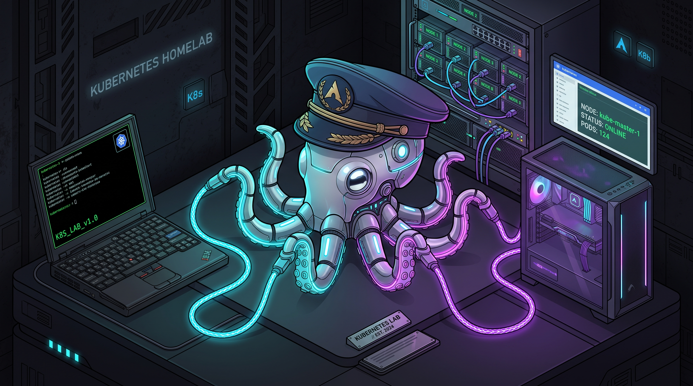
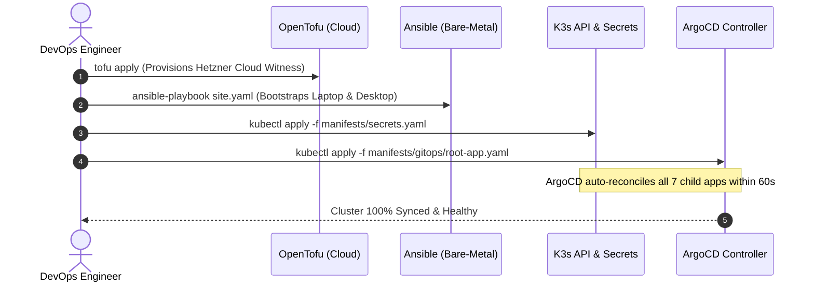

<div align="center">

<table align="center">
  <tr>
    <td align="center">
      <br/>
      <sub><b>Mesh-Octo ("Kube-Weaver")</b><br/><i>The Homelab Overseer & Mesh Sentinel</i></sub>
    </td>
  </tr>
</table>

# full-stack-cluster

**⚡ Production-Grade Multi-Node K3s Cluster over Tailscale WireGuard Mesh with Declarative GitOps & Distributed HA Storage ⚡**<br/>
<sub>Engineered on Arch Linux • Flannel MTU 1230 Tuning • Zero-Trust NetworkPolicies • Sub-Second DB Failover</sub>

<br/>

[](https://kubernetes.io)
[](https://k3s.io)
[](https://tailscale.com)
[](https://archlinux.org)
[](https://argo-cd.readthedocs.io)
[](https://longhorn.io)
[](https://cloudnative-pg.io)
[](https://grafana.com)
[](https://opentofu.org)
[](LICENSE)

</div>

---

## 📖 The Lore & Developer's Motivation

> *"Every engineer remembers the first time they looked past high-level cloud abstractions and asked: How does this actually work on raw bare metal?"*

This project marks my very first journey into building, troubleshooting, and mastering an enterprise-grade Kubernetes cluster from the physical silicon up. Rather than clicking a button on a managed cloud provider (EKS/GKE) or spinning up an ephemeral Minikube VM, I wanted to experience the **unfiltered reality of distributed systems engineering**:

1. **Mastering Heterogeneous Hardware:** Connecting a mobile laptop (Lenovo ThinkPad L480 Master), a high-IOPS desktop workstation (`richard-desktopp` NVMe Worker), and a remote cloud VPS across dynamic physical networks.
2. **Conquering Bare-Metal Realities:** Solving hard networking challenges—such as WireGuard MTU fragmentation drops, Linux kernel forwarding rules, and Arch Linux `systemd-resolved` stub DNS loops—without cutting corners.
3. **The Engineering Metamorphosis:** Transforming a fragile initial setup (monolithic YAMLs, plaintext secrets, and reactive bash scripts) through a rigorous **6-Phase Architectural Evolution** into a declarative, self-healing GitOps platform powered by ArgoCD, Longhorn replicated storage, CloudNativePG database quorum, and automated Ansible/OpenTofu provisioning.

This repository is not just a demo—it is an **open-source engineering reference** and portfolio showcase demonstrating deep Linux internals, cloud-native architecture, and production DevOps discipline.

---

## 🏛️ The 6 Core Engineering Pillars

| Pillar | Focus Area | Technology Stack | Production Implementation |
| :--- | :--- | :--- | :--- |
| **1. Hybrid Networking** | Secure Mesh & Encapsulation | **Tailscale (WireGuard) + Flannel CNI** | MTU 1230 tuning ($1280 - 50 = 1230$) preventing silent packet drops; `systemd-resolved` 127.0.0.53 bypass. |
| **2. Microservices & Ingress** | Stateless Apps & Zero-Trust | **Nginx SPA + Flask WSGI + Traefik** | Multi-stage OCI containers, Gunicorn WSGI, cert-manager automated TLS, Cloudflare Zero-Trust Tunnels. |
| **3. GitOps & Automation** | Declarative Delivery | **ArgoCD (App of Apps)** | Git as Single Source of Truth; automated reconciliation, self-healing (`selfHeal=true`), and drift pruning. |
| **4. Distributed State & HA DB** | Storage Resilience | **Longhorn CSI + CloudNativePG** | Real-time synchronous NVMe block mirroring over mesh; 2-instance PostgreSQL cluster with sub-second failover. |
| **5. Infrastructure as Code** | Bare-Metal & Cloud IaC | **Ansible + OpenTofu (Terraform)** | Zero-touch OS bootstrapping via Ansible; OpenTofu provisioning of cloud witness for 3-node $2N+1$ `etcd` quorum. |
| **6. Full-Stack Observability** | SRE Telemetry & Logging | **Prometheus + Grafana + Loki + Promtail** | LGTM stack monitoring node metrics, Tailscale WireGuard bandwidth, database replication lag, and Pod logs. |

---

## 🌐 Network & Encapsulation Breakdown

### The Dual-Overlay MTU Sizing Formula

When tunneling Kubernetes CNI traffic across an encrypted Layer 3 WireGuard mesh (Tailscale), every packet is encapsulated twice. Standard Ethernet MTU (1500 bytes) fails silently over WireGuard.

```
==================================================================================================
                 DUAL-LAYER OVERLAY ENCAPSULATION & MTU BREAKDOWN (TOTAL: 1280 BYTES)
==================================================================================================

 [Physical Ethernet Frame / WireGuard Payload] -------------------------------- (MTU: 1280 Bytes)
  │
  ├── Outer IP Header ...........................................................   20 Bytes
  ├── UDP Header (WireGuard / VXLAN Port 8472) ..................................    8 Bytes
  ├── VXLAN Header (VNI / Flags) ................................................    8 Bytes
  ├── Inner Ethernet Frame Header ...............................................   14 Bytes
  │   ──────────────────────────────────────────────────────────────────────────────────────────
  │   TOTAL FLANNEL ENCAPSULATION OVERHEAD ......................................   50 Bytes
  │
  └── INNER POD IP PACKET (MAX PAYLOAD) ......................................... 1230 Bytes
      │
      ├── Inner IP Header (Pod Network: 10.42.x.y) ..............................   20 Bytes
      ├── TCP Header (HTTP / PostgreSQL Data) ...................................   20 Bytes
      └── Max TCP MSS (Maximum Segment Size) .................................... 1190 Bytes
==================================================================================================
```

```mermaid
graph LR
    subgraph ClientLayer ["Client Access"]
        USER["Web Browser"] -->|HTTPS / Port 443| INGRESS["Traefik Ingress Controller<br/>(tickets.homelab.local)"]
    end

    subgraph MeshOverlay ["Tailscale WireGuard Mesh (MTU: 1280)"]
        INGRESS -->|Proxy Pass /api/*| BACKEND["ticket-backend (Flask API)<br/>Replicas: 2 (Spread via PodAntiAffinity)"]
    end

    subgraph DataPlane ["HA Storage & Database Mesh"]
        BACKEND -->|TCP 5432 (CoreDNS ticket-db-rw)| DB_PRIMARY["CloudNativePG Primary<br/>(Desktop Node)"]
        DB_PRIMARY ==="WAL Streaming"===> DB_STANDBY["CloudNativePG Standby<br/>(Laptop Master)"]
        DB_PRIMARY --- LONGHORN["Longhorn CSI Replicated Storage<br/>(Sync NVMe Mirror across Nodes)"]
    end
```

---

## 📁 Repository Directory Structure

```text
full-stack-cluster/
├── .github/
│   └── workflows/
│       └── ci.yaml                   # Multi-Arch Container Builds (GHCR)
├── apps/
│   ├── backend/                      # Production Flask + Gunicorn Microservice
│   │   ├── Dockerfile
│   │   ├── requirements.txt
│   │   └── src/
│   └── frontend/                     # Production Nginx SPA
│       ├── Dockerfile
│       ├── nginx.conf
│       └── src/
├── config/
│   └── k3s/                          # Declarative K3s Configs (MTU 1230, static DNS)
│       ├── README.md
│       ├── agent-config.yaml.example
│       ├── config.yaml.example
│       └── resolv.conf
├── docs/                             # Engineering Runbooks & Technical Specifications
│   ├── OCTO_Squid_mascot.jpeg        # Cluster Mascot Image Asset
│   ├── gitops-workflow.md            # ArgoCD Operations & Disaster Recovery
│   ├── iac-and-provisioning.md       # Ansible & OpenTofu Provisioning
│   ├── ingress-and-exposure.md       # Ingress, TLS & Cloudflare Tunnels
│   ├── observability-and-sre.md      # LGTM Stack & SRE Runbook
│   └── storage-and-ha.md             # Longhorn Storage & CNPG Replication
├── infrastructure/
│   ├── ansible/                      # Idempotent Bare-Metal Automation
│   │   ├── group_vars/
│   │   ├── inventory/
│   │   ├── playbooks/
│   │   └── roles/
│   └── opentofu/                     # Cloud-Witness IaC (3-Node etcd Quorum)
│       ├── cloud-init.yaml
│       ├── main.tf
│       ├── outputs.tf
│       ├── terraform.tfvars.example
│       └── variables.tf
├── manifests/
│   ├── base/                         # Base K8s manifests (Deployments, Services, RBAC)
│   │   ├── argocd/                   # ArgoCD GitOps Stack
│   │   ├── database/                 # CloudNativePG Operator
│   │   ├── logging/                  # Grafana Loki & Promtail DaemonSet
│   │   ├── monitoring/               # Prometheus, Grafana & Dashboards
│   │   ├── networking/               # Traefik Ingress, cert-manager, NetworkPolicies
│   │   ├── portainer/                # Portainer CE with Scoped Least-Privilege RBAC
│   │   ├── storage/                  # Longhorn Distributed Block Storage CSI
│   │   └── ticket-system/            # Frontend & Backend Workloads
│   ├── gitops/
│   │   ├── apps/                     # Child Applications (7 Modular Apps)
│   │   └── root-app.yaml             # Master Root ArgoCD Application
│   ├── overlays/
│   │   └── homelab/                  # Homelab Hardware Overlay & CNPG Cluster
│   ├── sealed-secrets-template.yaml  # Bitnami SealedSecrets CRD Template
│   └── secrets.example.yaml          # Declarative Secret Vorlage
├── .gitignore
├── ARCHITECTURE.md                   # Complete Architectural Reference Specification
├── LICENSE                           # MIT License
├── README.md                         # Portfolio Showcase Overview & Runbook
└── ROADMAP.md                        # Strategic Evolution Roadmap (100% Completed)
```

---

## ⚡ 10-Minute Zero-Touch Disaster Recovery

In case of catastrophic hardware loss, the entire distributed hybrid cluster can be rebuilt from scratch in under 10 minutes:



### Execution Steps:

```bash
# 1. Provision Cloud Witness for 3-Node etcd Quorum (2 min)
cd infrastructure/opentofu
cp terraform.tfvars.example terraform.tfvars
tofu init && tofu apply -auto-approve

# 2. Bootstrap Bare-Metal Linux Nodes with Ansible (4 min)
cd ../ansible
cp inventory/hosts.ini.example inventory/hosts.ini
cp group_vars/all.yaml.example group_vars/all.yaml
ansible-playbook -i inventory/hosts.ini playbooks/site.yaml

# 3. Apply Encrypted Secrets & Trigger GitOps Auto-Assembly (2 min)
kubectl apply -f manifests/secrets.yaml
kubectl apply -k manifests/base/argocd/
kubectl apply -f manifests/gitops/root-app.yaml
```

### Verification Command:
```bash
kubectl get nodes,pods -A -o wide
```

---

## 🎛️ Tooling & Service Access Matrix

| Service | Internal Domain URL | Ingress Controller | Operational Purpose |
| :--- | :--- | :--- | :--- |
| **Incident Hub (SPA)** | `https://tickets.homelab.local` | Traefik + cert-manager | Modern glassmorphic incident tracking frontend & REST API. |
| **ArgoCD GitOps** | `https://argocd.homelab.local` | Traefik + cert-manager | Continuous Delivery & automated cluster state reconciliation. |
| **Grafana Telemetry** | `https://grafana.homelab.local` | Traefik + cert-manager | Centralized metrics & log dashboards (LGTM Stack). |
| **Longhorn Storage** | `https://longhorn.homelab.local` | Traefik + cert-manager | Distributed block storage volume management & disk health. |
| **Portainer CE** | `https://portainer.homelab.local` | Traefik + cert-manager | Scoped least-privilege administrative container console. |

---

## 📚 Deep-Dive Documentation Index

* 📖 [**ARCHITECTURE.md**](ARCHITECTURE.md): Complete engineering specification, dual-overlay MTU breakdown, and failure recovery matrices.
* 🗺️ [**ROADMAP.md**](ROADMAP.md): 6-phase strategic transformation roadmap (100% Completed).
* 🔄 [**docs/gitops-workflow.md**](docs/gitops-workflow.md): ArgoCD App-of-Apps operations, disaster recovery, and webhook automation.
* 💾 [**docs/storage-and-ha.md**](docs/storage-and-ha.md): Longhorn synchronous block replication and CloudNativePG failover design.
* 🌐 [**docs/ingress-and-exposure.md**](docs/ingress-and-exposure.md): Traefik Ingress, cert-manager TLS, NetworkPolicies, and Cloudflare Tunnels.
* 🛠️ [**docs/iac-and-provisioning.md**](docs/iac-and-provisioning.md): Ansible bare-metal provisioning and OpenTofu witness setup.
* 📈 [**docs/observability-and-sre.md**](docs/observability-and-sre.md): Full LGTM monitoring stack, PromQL & LogQL cheat sheets, and SRE incident triage.

---

## 📄 License

Distributed under the **MIT License**. See [`LICENSE`](LICENSE) for details.

<div align="center">
  <sub>Crafted with passion, caffeine, and bare-metal curiosity by <b>Richard (<a href="https://github.com/Ri4ards2006">Ri4ards2006</a>)</b>.</sub>
</div>
