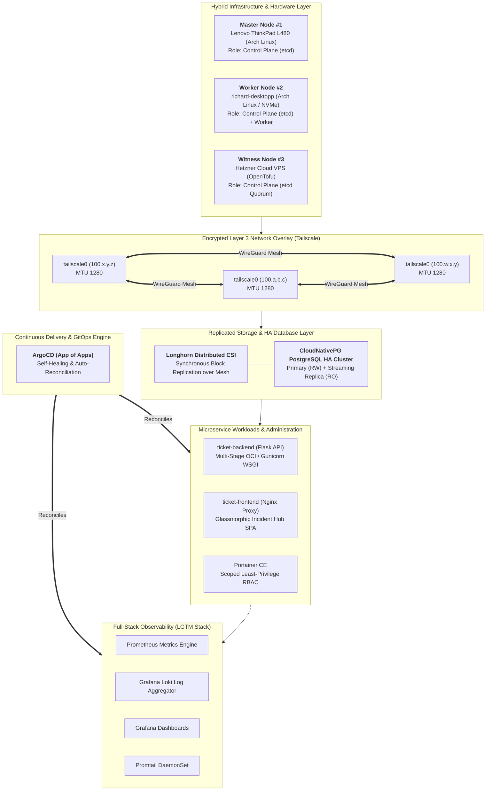

# Enterprise-Grade Multi-Node K3s Hybrid Platform over Tailscale WireGuard Mesh

[](https://kubernetes.io)
[](https://k3s.io)
[](https://tailscale.com)
[](https://argo-cd.readthedocs.io)
[](https://longhorn.io)
[](https://cloudnative-pg.io)
[](https://grafana.com)
[](https://opentofu.org)
[](LICENSE)

---

## 1. Executive Platform Architecture

This repository hosts the complete, production-grade Infrastructure as Code (IaC), GitOps continuous delivery pipelines, and microservice definitions for a **distributed, multi-node hybrid Kubernetes ([K3s](https://k3s.io)) cluster**. 

The platform connects bare-metal Arch Linux / EndeavourOS endpoints across disparate physical networks into an encrypted **[Tailscale](https://tailscale.com) WireGuard mesh**, augmented by a lightweight cloud witness node for **3-node high-availability etcd quorum**.



---

## 2. Core Engineering Innovations & Highlights

### ⚡ Tailscale WireGuard Mesh & Mathematical MTU Optimization
* **The Challenge:** Tailscale clamps its virtual interface (`tailscale0`) to **1280 bytes** (the IPv6 baseline MTU). Flannel's default VXLAN overlay adds **50 bytes** of encapsulation header. Standard 1450-byte packets cause silent packet drops over WireGuard.
* **The Solution:** We enforce a tuned MTU of **1230 bytes** ($1280 - 50 = 1230$) in K3s declarative configuration (`/etc/rancher/k3s/config.yaml`), eliminating packet fragmentation and connection timeouts.

### 🛡️ Arch Linux `systemd-resolved` DNS Loopback Bypass
* **The Challenge:** Arch Linux routes local DNS through `127.0.0.53`. Container network namespaces cannot reach this host-loopback address, causing CoreDNS crash loops and container build failures.
* **The Solution:** Declarative Kubelet upstream nameserver enforcement via `--resolv-conf=/etc/rancher/k3s/resolv.conf` pointing directly to `1.1.1.1` and `8.8.8.8`.

### 💾 Distributed Block Storage (Longhorn CSI) & HA Database (CloudNativePG)
* **Zero Node-Pinning:** Replaced single-node `local-path` storage with **Longhorn CSI**, performing real-time synchronous block replication across physical NVMe disks over the WireGuard mesh.
* **Database Quorum:** PostgreSQL is managed by **CloudNativePG (CNPG)** with streaming WAL replication and sub-second automatic failover.

### 🔄 Declarative GitOps Engine (ArgoCD "App of Apps")
* The entire cluster state is defined as code. ArgoCD monitors `manifests/gitops/root-app.yaml` with **Self-Healing** (`selfHeal=true`) and **Automatic Pruning** (`prune=true`).

### 📊 Full-Stack Observability (LGTM Stack)
* **Prometheus & Grafana:** Pre-provisioned dashboards for node metrics, WireGuard bandwidth, and database transaction rates.
* **Loki & Promtail:** Centralized distributed log streaming from `/var/log/pods` across all physical nodes.

### 🚀 Zero-Touch Bare-Metal Automation (Ansible & OpenTofu)
* **Ansible:** Fully automated OS kernel parameter tuning, Tailscale authentication, and K3s multi-master bootstrapping.
* **OpenTofu:** Automated provisioning of a Hetzner Cloud VPS witness node, guaranteeing an odd number of voting members ($2N+1 = 3$) for unshakeable `etcd` quorum.

---

## 3. Repository Architecture & Layout

```text
full-stack-cluster/
├── .github/
│   └── workflows/
│       └── ci.yaml                   # Multi-Arch Container Builds (GHCR)
├── apps/
│   ├── backend/                      # Production Flask + Gunicorn Microservice
│   │   ├── Dockerfile
│   │   ├── requirements.txt
│   │   └── src/
│   └── frontend/                     # Production Nginx SPA
│       ├── Dockerfile
│       ├── nginx.conf
│       └── src/
├── config/
│   └── k3s/                          # Declarative K3s Configs (MTU 1230, static DNS)
├── docs/                             # Engineering Runbooks & Specifications
│   ├── gitops-workflow.md            # ArgoCD Operations & Disaster Recovery
│   ├── iac-and-provisioning.md       # Ansible & OpenTofu Provisioning
│   ├── ingress-and-exposure.md       # Ingress, TLS & Cloudflare Tunnels
│   ├── observability-and-sre.md      # LGTM Stack & SRE Runbook
│   └── storage-and-ha.md             # Longhorn Storage & CNPG Replication
├── infrastructure/
│   ├── ansible/                      # Idempotent Bare-Metal Automatisierung
│   │   ├── group_vars/
│   │   ├── inventory/
│   │   ├── playbooks/
│   │   └── roles/
│   └── opentofu/                     # Cloud-Witness IaC (3-Node etcd Quorum)
│       ├── cloud-init.yaml
│       ├── main.tf
│       ├── outputs.tf
│       ├── terraform.tfvars.example
│       └── variables.tf
├── manifests/
│   ├── base/                         # Base K8s manifests (Deployments, Services, RBAC)
│   │   ├── argocd/                   # ArgoCD GitOps Stack
│   │   ├── database/                 # CloudNativePG Operator
│   │   ├── logging/                  # Grafana Loki & Promtail DaemonSet
│   │   ├── monitoring/               # Prometheus, Grafana & Dashboards
│   │   ├── networking/               # Traefik Ingress, cert-manager, NetworkPolicies
│   │   ├── portainer/                # Portainer CE with Scoped Least-Privilege RBAC
│   │   ├── storage/                  # Longhorn Distributed Block Storage CSI
│   │   └── ticket-system/            # Frontend & Backend Workloads
│   ├── gitops/
│   │   ├── apps/                     # Child Applications (7 Modular Apps)
│   │   └── root-app.yaml             # Master Root ArgoCD Application
│   ├── overlays/
│   │   └── homelab/                  # Homelab Hardware Overlay & CNPG Cluster
│   ├── sealed-secrets-template.yaml  # Bitnami SealedSecrets CRD Template
│   └── secrets.example.yaml          # Declarative Secret Vorlage
├── .gitignore
├── ARCHITECTURE.md                   # Complete Architectural Reference
├── README.md                         # Portfolio Showcase Overview & Runbook
└── ROADMAP.md                        # Strategic Evolution Roadmap (100% Complete)
```

---

## 4. 10-Minute Zero-Touch Disaster Recovery Runbook

To provision the entire hybrid cluster from scratch after total hardware loss:

### Step 1: Provision the Cloud Witness Node (2 Minutes)
```bash
cd infrastructure/opentofu
cp terraform.tfvars.example terraform.tfvars
# Insert your Hetzner Cloud token & Tailscale auth key
tofu init && tofu apply -auto-approve
```

### Step 2: Bootstrap Bare-Metal Arch Linux Nodes with Ansible (4 Minutes)
```bash
cd ../ansible
cp inventory/hosts.ini.example inventory/hosts.ini
cp group_vars/all.yaml.example group_vars/all.yaml
ansible-playbook -i inventory/hosts.ini playbooks/site.yaml
```

### Step 3: Inject Secrets & Trigger GitOps Self-Assembly (2 Minutes)
```bash
# 1. Apply encrypted secrets template
kubectl apply -f manifests/secrets.yaml

# 2. Bootstrap ArgoCD engine
kubectl apply -k manifests/base/argocd/

# 3. Apply the App-of-Apps root controller
kubectl apply -f manifests/gitops/root-app.yaml
```

Within **10 minutes**, ArgoCD will reconcile all storage classes, databases, microservices, ingress routes, and monitoring stacks automatically.

---

## 5. Ingress Endpoints & Management Portals

| Service | Local Host / URL | Ingress Controller | Backend Target |
| :--- | :--- | :--- | :--- |
| **Incident Ticket Hub (SPA)** | `https://tickets.homelab.local` | Traefik + cert-manager | `ticket-frontend:80` |
| **ArgoCD GitOps Console** | `https://argocd.homelab.local` | Traefik + cert-manager | `argocd-server:80` |
| **Grafana Telemetry Hub** | `https://grafana.homelab.local` | Traefik + cert-manager | `grafana:3000` |
| **Longhorn Storage Console** | `https://longhorn.homelab.local` | Traefik + cert-manager | `longhorn-frontend:80` |
| **Portainer CE Console** | `https://portainer.homelab.local` | Traefik + cert-manager | `portainer:9000` |

---

## 6. Deep-Dive Engineering Documentation

* 📖 [`ARCHITECTURE.md`](ARCHITECTURE.md): Complete architectural specification, dual-overlay MTU breakdown, and failure recovery matrices.
* 🗺️ [`ROADMAP.md`](ROADMAP.md): 6-phase strategic transformation roadmap (100% Completed).
* 🔄 [`docs/gitops-workflow.md`](docs/gitops-workflow.md): ArgoCD App-of-Apps operations, disaster recovery, and webhook automation.
* 💾 [`docs/storage-and-ha.md`](docs/storage-and-ha.md): Longhorn synchronous block replication and CloudNativePG failover design.
* 🌐 [`docs/ingress-and-exposure.md`](docs/ingress-and-exposure.md): Traefik Ingress, cert-manager TLS, NetworkPolicies, and Cloudflare Tunnels.
* 🛠️ [`docs/iac-and-provisioning.md`](docs/iac-and-provisioning.md): Ansible bare-metal provisioning and OpenTofu witness setup.
* 📈 [`docs/observability-and-sre.md`](docs/observability-and-sre.md): Full LGTM monitoring stack, PromQL & LogQL cheat sheets, and SRE incident triage.

---

## 7. License

Distributed under the **MIT License**. See [`LICENSE`](LICENSE) for more information.
