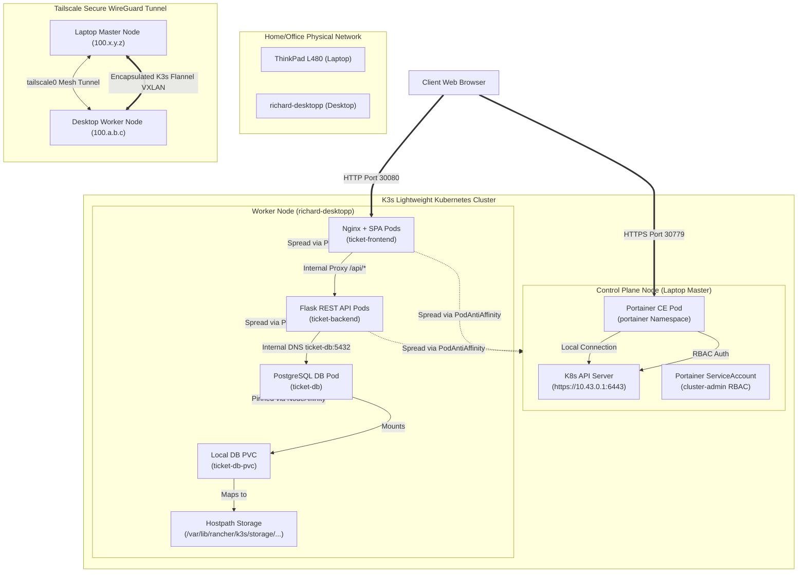

# Production-Ready Deployment & Architecture Reference

This reference document outlines the deployment architecture, configuration manifests, and administration runbook for hosting containerized applications on a local multi-node K3s Kubernetes cluster spanned across private home network nodes via Tailscale.

---

## 1. System Architecture Overview

The cluster consists of two physical endpoints running EndeavourOS (Arch Linux), joined together using Tailscale's secure WireGuard mesh topology. Workload distribution is managed dynamically via scheduling rules, ensuring both persistent state alignment and microservice high availability.

### Network & Node Infrastructure
*   **Control Plane Node (Laptop):** Lenovo ThinkPad L480 running Arch Linux. Hosts the core Kubernetes Control Plane components, API Server, Scheduler, and Portainer CE.
*   **Worker Node (Agent):** Desktop Machine (`richard-desktopp`) running Arch Linux. Handles data-intensive operations and stateful storage.
*   **Tailscale Mesh VPN:** Encapsulates all node-to-node control plane and Pod-to-Pod overlay traffic over the virtual interface `tailscale0`, ensuring security regardless of physical networks.



---

## 2. Infrastructure Configuration Manifests

The cluster deployments are split into two primary YAML manifests, providing absolute separation of concerns between administration tools and application workloads.

### A. Portainer CE Stack ([portainer-k3s.yaml](file:///home/richard/full-stack-cluster/portainer-k3s.yaml))
Defines the `portainer` administrative namespace, PVC, NodePort services, and the RBAC elements needed to authorize Portainer against the API server.

### B. Ticket System App Stack ([ticket-system-app.yaml](file:///home/richard/full-stack-cluster/ticket-system-app.yaml))
Defines the `ticket-system` namespace, database persistent layer, Backend REST API (Flask), and a modern Nginx reverse-proxied glassmorphic SPA frontend.

> [!NOTE]
> The Flask backend automatically checks the database status on startup, creates the required `tickets` database schema, and populates it with default mock tickets if empty.

---

## 3. Advanced Scheduling & Traffic Design

### Multi-Node Scheduling Rules
1.  **Database Node Affinity:** The PostgreSQL database is restricted to the Desktop (`richard-desktopp`) using `nodeAffinity`. Since local-path storage is node-bound, pinning the pod to this specific hostname prevents volume scheduling failures and ensures data persistence remains tied to the underlying NVMe storage.
2.  **App Tier Anti-Affinity:** Both frontend and backend deployments run with `podAntiAffinity` rules. The scheduler is directed to spread replicas across different physical nodes (Laptop and Desktop) to avoid single points of failure.

### Unified In-Cluster Reverse Proxy Routing
To avoid Cross-Origin Resource Sharing (CORS) complications and keep the database completely secure, the Client's web browser communicates exclusively with the frontend on port `30080`.
*   **Static Assets:** Served directly by Nginx (e.g., `index.html`, stylesheets).
*   **API Routes (`/api/*`):** Transparently proxied internally by Nginx to the backend Flask API (`http://ticket-backend:5000`) using the cluster's internal CoreDNS resolution.
*   **Headless DB Security:** The database is exposed via a ClusterIP service `ticket-db`, rendering the storage port (`5432`) completely invisible outside the internal network.

---

## 4. Portainer API Integration & RBAC Resolution

When connecting Portainer CE to the local cluster, administrative tools frequently throw TLS verification errors (`x509: certificate signed by unknown authority`) or connection failures (`broken pipe`) when trying to dial `https://10.43.0.1:6443` or the public endpoint.

### Why this happens:
1.  **SAN Mismatches:** The API Server's SSL certificate contains specific Subject Alternative Names (SANs) generated during K3s installation. Querying the API server over a raw Tailscale IP or a custom local cluster IP fails TLS validation if those IPs are missing from the SAN list.
2.  **Insufficient Privileges:** By default, pods run with the `default` ServiceAccount, which lacks any authorization to read cluster metrics, nodes count, or hardware capacity.

### How the Portainer RBAC resolves this:
*   **ServiceAccount Mounting:** A dedicated `portainer-sa-admin` ServiceAccount is defined and attached to the Portainer pod. The token and the internal Cluster CA certificate are automatically mounted inside the container at `/var/run/secrets/kubernetes.io/serviceaccount/`.
*   **ClusterRoleBinding:** The ServiceAccount is bound to the cluster's root administrative role `cluster-admin` via a `ClusterRoleBinding`.
*   **In-Cluster Target:** Inside Portainer, the cluster is registered using the internal DNS name **`https://kubernetes.default.svc`**. Because the pod trusts the cluster CA certificate mounted by Kubernetes, TLS verification succeeds out-of-the-box, completely avoiding TLS and broken pipe errors.

> [!TIP]
> If manual setup via the Portainer Web UI is preferred using the external IP (`https://10.43.0.1:6443`), toggle the **"Skip TLS verification"** switch to bypass hostname and certificate authority checks.

---

## 5. Step-by-Step Deployment Runbook

Perform the following commands on the laptop (master node) terminal. Because the master config file is owned by root, commands are prefixed with `sudo` and run with the explicit `--kubeconfig` parameter.

### Step 1: Deploy Portainer CE
Apply the administration stack to set up namespace, RBAC, and services:
```bash
sudo kubectl --kubeconfig /etc/rancher/k3s/k3s.yaml apply -f portainer-k3s.yaml
```

### Step 2: Deploy Ticket System Application Stack
Apply the full application manifest containing the database, API backend, and web frontend:
```bash
sudo kubectl --kubeconfig /etc/rancher/k3s/k3s.yaml apply -f ticket-system-app.yaml
```

### Step 3: Verify Scheduling and Distribution
Ensure that the database is pinned to `richard-desktopp` and that frontend/backend replicas are distributed across nodes:
```bash
sudo kubectl --kubeconfig /etc/rancher/k3s/k3s.yaml get pods -o wide -n ticket-system
```
*Expected Output:*
*   `ticket-db-*` is running on `richard-desktopp`.
*   `ticket-backend-*` pods are distributed between the master laptop and `richard-desktopp`.
*   `ticket-frontend-*` pods are distributed between the master laptop and `richard-desktopp`.

### Step 4: Verify Volume Binding & Storage Class
Confirm the local-path-provisioner has dynamically created the persistent volumes:
```bash
sudo kubectl --kubeconfig /etc/rancher/k3s/k3s.yaml get pvc -A
sudo kubectl --kubeconfig /etc/rancher/k3s/k3s.yaml get pv
```

### Step 5: Monitor Startup Logs
The backend pod will download Flask dependencies and initialize the DB. Track progress:
```bash
sudo kubectl --kubeconfig /etc/rancher/k3s/k3s.yaml logs -n ticket-system -l app=ticket-backend --tail=100 -f
```

---

## 6. Verification and Troubleshooting Cheat Sheet

### Accessing the Web Interfaces
| Service | External URL | Description |
| :--- | :--- | :--- |
| **Portainer HTTP** | `http://<node-tailscale-ip>:30770` | Unencrypted Portainer Panel |
| **Portainer HTTPS** | `https://<node-tailscale-ip>:30779` | Secure Portainer Panel |
| **TicketSystem UI** | `http://<node-tailscale-ip>:30080` | Glassmorphic Incident Dashboard |

### Troubleshooting Commands

*   **Inspect Pod Failures:**
    If a pod is in `ContainerCreating` or `CrashLoopBackOff`, describe the pod to check events:
    ```bash
    sudo kubectl --kubeconfig /etc/rancher/k3s/k3s.yaml describe pod <pod-name> -n ticket-system
    ```

*   **Inspect PVC Pending State:**
    If the database PVC is stuck in `Pending`, verify why the storage class has not bound the volume:
    ```bash
    sudo kubectl --kubeconfig /etc/rancher/k3s/k3s.yaml describe pvc ticket-db-pvc -n ticket-system
    ```
    > [!NOTE]
    > Since K3s uses `WaitForFirstConsumer`, the PVC will remain `Pending` until the `ticket-db` pod is scheduled.

*   **Test Internal Database Connection:**
    Check database network connectivity directly from a running backend pod:
    ```bash
    sudo kubectl --kubeconfig /etc/rancher/k3s/k3s.yaml exec -n ticket-system -it deployment/ticket-backend -- python -c "import psycopg2; print(psycopg2.connect(host='ticket-db', database='ticket_db', user='postgres', password='SuperSecretDbPassw0rd'))"
    ```
