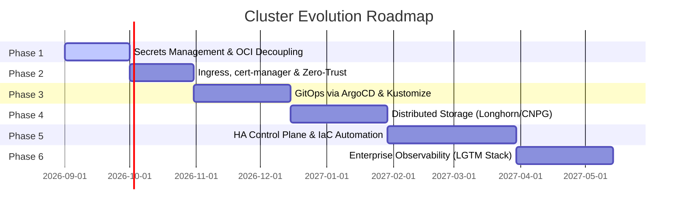

# Strategic Engineering Roadmap

## Vision Statement
Transform the existing **full-stack-cluster** from an experimental multi-node bare-metal prototype into an enterprise-grade, GitOps-driven, resilient hybrid-cloud Kubernetes platform with automated provisioning, zero-trust ingress, high-availability storage, and continuous observability.

---

## Evolution Phases Overview

---

## Phase 1: Stabilization, Security & Workload Decoupling
**Goal:** Eliminate plain-text secrets, decouple code from Kubernetes manifests, and establish immutable build artifacts.

- [ ] **Secrets Management:**
  - Implement [Sealed Secrets](https://github.com/bitnami-labs/sealed-secrets) or [External Secrets Operator (ESO)](https://external-secrets.io/) connected to HashiCorp Vault / Cloud Secret Manager.
  - Remove all hardcoded credentials (`SuperSecretDbPassw0rd`) from Git manifests and history.
- [ ] **Application Containerization & OCI Registry:**
  - Extract the Flask REST API into a dedicated `apps/backend` codebase with a production `Dockerfile` (using `gunicorn` instead of `Flask dev server`) and pinned `requirements.txt`.
  - Extract the Nginx SPA into `apps/frontend` with modular web assets.
  - Set up **GitHub Actions CI** to build, lint, scan (Trivy/SonarQube), and push multi-arch OCI images to **GitHub Packages (`ghcr.io`)**.
- [ ] **Declarative K3s Configuration:**
  - Replace dynamic bash systemd patching with declarative `/etc/rancher/k3s/config.yaml` containing static nameservers and Flannel MTU flags.

---

## Phase 2: Ingress, Modern Networking & Zero-Trust
**Goal:** Terminate reliance on NodePorts and insecure HTTP by deploying modern ingress routing and automated TLS.

- [ ] **Ingress Controller Deployment:**
  - Activate K3s built-in **Traefik** or deploy **NGINX Ingress Controller / Envoy Gateway**.
  - Replace NodePorts (`30080`, `30779`, `30770`) with structured `Ingress` / `IngressRoute` resources.
- [ ] **Automated Certificate Management:**
  - Deploy `cert-manager` configured with Let's Encrypt ACME (DNS-01 challenge via Cloudflare API or HTTP-01 challenge).
- [ ] **Zero-Trust & Remote Access:**
  - Implement **Cloudflare Tunnels (`cloudflared`)** or **Tailscale Kubernetes Ingress** to securely expose internal services without opening public NAT router ports.
- [ ] **Network Policies:**
  - Enforce default-deny egress/ingress network policies per namespace (`ticket-system`, `portainer`) restricting inter-pod lateral movement.

---

## Phase 3: GitOps & Declarative Cluster Management
**Goal:** Transition from manual `kubectl apply` commands to automated, auditable continuous delivery.

- [ ] **GitOps Controller:**
  - Deploy **ArgoCD** or **Flux v2** inside the cluster.
- [ ] **Repository Restructuring (Kustomize / Helm):**
  - Modularize manifests into `base/` and environment overlays (`overlays/dev/`, `overlays/prod/`).
  - Package full-stack application workloads into reusable Helm Charts.
- [ ] **Drift Detection & Automated Sync:**
  - Configure self-healing GitOps pipelines that automatically reconcile manual cluster drifts against the main Git repository branch.

---

## Phase 4: Distributed Storage & HA Data Layer
**Goal:** Eliminate single-node storage pinning and achieve resilient data persistence.

- [ ] **Distributed Block Storage:**
  - Deploy **Longhorn** or **Rook-Ceph** across cluster nodes to enable multi-replica synchronous storage.
  - Remove hardcoded `nodeAffinity` for PostgreSQL, allowing the DB pod to failover seamlessly between nodes.
- [ ] **CloudNativePG Database Operator:**
  - Migrate standalone PostgreSQL deployment to **CloudNativePG** (CNPG) operator.
  - Enable continuous automated WAL archiving and scheduled backups to S3-compatible object storage (MinIO / AWS S3 / Cloudflare R2).

---

## Phase 5: High Availability Control Plane & Bare-Metal IaC
**Goal:** Remove the single-point-of-failure laptop control plane and automate bare-metal node provisioning.

- [ ] **HA Control Plane (Embedded etcd / External Datastore):**
  - Scale control plane to 3 nodes with embedded `etcd` or external HA datastore (Kine with PostgreSQL/MySQL).
  - Integrate an external cloud/VPS witness node to avoid split-brain scenarios on 2-node physical setups.
- [ ] **Infrastructure as Code (IaC) & Automation:**
  - Write **Ansible Playbooks** for automated bare-metal node bootstrapping (OS packages, kernel parameters, WireGuard/Tailscale join, K3s installation).
  - Utilize **Terraform / OpenTofu** for cloud resources, DNS records, and cloudflare tunnels.

---

## Phase 6: Observability & Telemetry (LGTM Stack)
**Goal:** Full visibility into cluster performance, logs, traces, and node health.

- [ ] **Metrics & Dashboards:**
  - Deploy `kube-prometheus-stack` (Prometheus, Alertmanager, Grafana).
  - Create dashboards for K3s node metrics, Tailscale tunnel latency, and application request rates.
- [ ] **Centralized Logging & Distributed Tracing:**
  - Deploy **Grafana Loki** + **Promtail** for container log aggregation.
  - Implement **OpenTelemetry (OTel)** instrumentation in Flask backend to monitor database query latencies.

