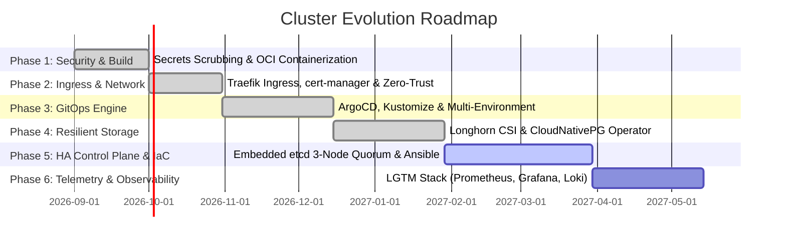

# Strategic Engineering Roadmap: Enterprise Evolution

## 1. Executive Summary & Vision

This roadmap outlines the systematic, phased metamorphosis of the **full-stack-cluster** from an experimental bare-metal multi-node prototype into an enterprise-grade, GitOps-automated, highly available hybrid-cloud Kubernetes platform.



---

## 2. Target Directory & Repository Structure

```text
full-stack-cluster/
├── .github/
│   └── workflows/
│       └── ci.yaml                   # Multi-arch container builds & push to GHCR
├── apps/
│   ├── backend/
│   │   ├── Dockerfile                # Multi-stage Python 3.11-slim + Gunicorn
│   │   ├── requirements.txt          # Explicitly pinned dependencies
│   │   ├── wsgi.py                   # Production WSGI entry point
│   │   └── src/
│   │       └── app.py                # Flask application & database connection pooling
│   └── frontend/
│       ├── Dockerfile                # Nginx Alpine image
│       ├── nginx.conf                # Reverse proxy config (/api/ routing)
│       └── src/
│           └── index.html            # SPA incident management dashboard
├── config/
│   └── k3s/                          # Declarative K3s node configs (MTU 1230, static DNS)
│       ├── README.md
│       ├── agent-config.yaml.example
│       ├── config.yaml.example
│       └── resolv.conf
├── docs/
│   ├── gitops-workflow.md            # ArgoCD operations, disaster recovery & App-of-Apps
│   ├── ingress-and-exposure.md       # Ingress, TLS & Cloudflare Tunnel runbook
│   └── storage-and-ha.md             # Longhorn CSI & CloudNativePG HA guide
├── manifests/
│   ├── base/                         # Base K8s manifests (Deployments, Services, RBAC)
│   │   ├── argocd/                   # Declarative ArgoCD base installation & ingress
│   │   ├── database/                 # CloudNativePG Operator
│   │   ├── networking/               # Ingress, cert-manager, NetworkPolicies, Cloudflare
│   │   ├── portainer/                # Portainer CE with scoped least-privilege RBAC
│   │   ├── storage/                  # Longhorn Distributed Block Storage CSI
│   │   └── ticket-system/            # Backend, Frontend
│   ├── gitops/                       # ArgoCD App-of-Apps definitions
│   │   ├── apps/                     # Child applications (ticket-system, portainer, networking, storage, database)
│   │   └── root-app.yaml             # Master Root ArgoCD Application
│   ├── overlays/
│   │   └── homelab/                  # Homelab hardware patches (CNPG Cluster, Replicas)
│   │       ├── kustomization.yaml
│   │       ├── patches/
│   │       └── pg-cluster.yaml
│   ├── sealed-secrets-template.yaml  # Bitnami SealedSecrets CRD template
│   └── secrets.example.yaml          # Declarative secrets template
├── ARCHITECTURE.md                   # Complete architectural specification
├── ROADMAP.md                        # Strategic development roadmap
├── LICENSE                           # MIT / Apache-2.0 License
└── README.md                         # Portfolio showcase overview & runbook
```

---

## 3. Detailed Phase Execution Plan

### Phase 1: Stabilization, Security & Workload Decoupling
* **Status:** Completed
* **Key Deliverables:**
  1. [x] **Git Secret Scrubbing:** Purge plain-text credentials (`SuperSecretDbPassw0rd`) from Git commit history and add comprehensive `.gitignore`.
  2. [x] **Secrets Management:** Create declarative secret templates (`secrets.example.yaml`) and SealedSecrets templates (`sealed-secrets-template.yaml`).
  3. [x] **Decouple Applications into OCI Images:**
     * Extract Flask REST API into `apps/backend` with multi-stage `Dockerfile` and Gunicorn WSGI server.
     * Extract Nginx SPA into `apps/frontend` with hardened `nginx.conf` and `Dockerfile`.
     * Configure GitHub Actions CI workflow (`.github/workflows/ci.yaml`) for multi-arch builds (`linux/amd64`, `linux/arm64`) to GHCR.
  4. [x] **Declarative K3s Config:** Replace systemd bash patches with declarative `/etc/rancher/k3s/config.yaml` (`config/k3s/`).

---

### Phase 2: Ingress, Modern Networking & Zero-Trust
* **Status:** Completed
* **Key Deliverables:**
  1. [x] **Decommission NodePorts:** Permanently remove NodePorts (`30080`, `30779`, `30770`) and transition to `ClusterIP`.
  2. [x] **Kustomize Base Architecture:** Modularize manifests into `manifests/base/ticket-system/` and `manifests/base/portainer/` with scoped least-privilege RBAC.
  3. [x] **Ingress Controller Deployment:** Provide unified Ingress resources for `tickets.homelab.local` and `portainer.homelab.local` targeting Traefik.
  4. [x] **Automated TLS:** Create `cert-manager` ClusterIssuer templates for local CA and Let's Encrypt ACME DNS-01 challenges.
  5. [x] **Zero-Trust Ingress (Cloudflare Tunnels):** Add `cloudflared` daemon manifests and configuration guide.
  6. [x] **Zero-Trust NetworkPolicies:** Implement strict database isolation (`allow-backend-to-db`) and default-deny policies.
  7. [x] **Homelab Overlay:** Create `manifests/overlays/homelab/` with hardware-specific NodeAffinity and replica distribution patches.

---

### Phase 3: GitOps & Declarative Cluster Management
* **Status:** Completed
* **Key Deliverables:**
  1. [x] **ArgoCD Base Setup:** Declarative base manifests in `manifests/base/argocd/` with Ingress and TLS routing (`argocd.homelab.local`).
  2. [x] **App of Apps Pattern:** Root controller `manifests/gitops/root-app.yaml` monitoring `manifests/gitops/apps/`.
  3. [x] **Automated Reconciliation:** Self-healing (`selfHeal=true`) and automatic pruning (`prune=true`) across all child workloads.
  4. [x] **Operations & Disaster Recovery Runbook:** Documented in `docs/gitops-workflow.md`.

---

### Phase 4: Distributed Storage & High-Availability Data Layer
* **Status:** Completed
* **Key Deliverables:**
  1. [x] **Distributed Block Storage (Longhorn CSI):**
     * Base manifests in `manifests/base/storage/` with Web UI Ingress (`longhorn.homelab.local`).
     * ArgoCD child application in `manifests/gitops/apps/storage-app.yaml`.
     * Multi-node synchronous block replication across physical NVMe disks.
  2. [x] **CloudNativePG (CNPG) Operator & Cluster:**
     * Operator base manifests in `manifests/base/database/` and ArgoCD app `manifests/gitops/apps/database-operator-app.yaml`.
     * High-availability 2-instance PostgreSQL cluster (`manifests/overlays/homelab/pg-cluster.yaml`) on Longhorn storage.
     * Hardened network policy (`allow-backend-to-db`) for CNPG streaming replication.
     * **Elimination of Node-Pinning:** Removed `db-node-affinity.yaml`, enabling instant cross-node database failover.

---

### Phase 5: High-Availability Control Plane & Bare-Metal IaC
* **Status:** Next Up / In Planning
* **Key Deliverables:**
  1. [ ] **HA Control Plane (Embedded etcd Quorum):**
     * Expand cluster from single master to **3-node etcd quorum** ($2N+1$ consensus).
     * Integrate an external lightweight Cloud VPS (e.g. Hetzner Cloud for ~3€/month) as the 3rd Control Plane Node / etcd-Witness in the Tailscale mesh.
  2. [ ] **Infrastructure-as-Code (Ansible & OpenTofu):**
     * Write Ansible playbooks for zero-touch bare-metal provisioning of Arch Linux / EndeavourOS nodes.
     * Manage Cloudflare DNS, Tunnels, and Cloud VPS resources via OpenTofu / Terraform.

---

### Phase 6: Full-Stack Observability & Telemetry (LGTM Stack)
* **Status:** Planned
* **Key Deliverables:**
  1. [ ] **Metrics:** Deploy `kube-prometheus-stack` (Prometheus Operator, Alertmanager, Grafana).
  2. [ ] **Dashboards:** Provision pre-configured dashboards for Node Exporter, K3s API server metrics, and Tailscale tunnel latency.
  3. [ ] **Centralized Logging:** Deploy **Grafana Loki** + **Promtail** for log aggregation across all Pods.
  4. [ ] **Distributed Tracing:** Instrument Flask backend using **OpenTelemetry (OTel)** to profile database latency.
