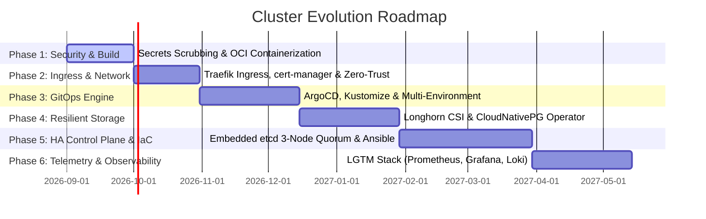

# Strategic Engineering Roadmap: Enterprise Evolution

## 1. Executive Summary & Vision

This roadmap outlines the systematic, phased metamorphosis of the **full-stack-cluster** from an experimental bare-metal multi-node prototype into an enterprise-grade, GitOps-automated, highly available hybrid-cloud Kubernetes platform.



---

## 2. Target Directory & Repository Structure

```text
full-stack-cluster/
├── .github/
│   └── workflows/
│       ├── build-backend.yaml        # Multi-arch container builds & push to GHCR
│       ├── build-frontend.yaml       # Frontend static SPA containerization
│       └── k8s-lint.yaml             # Kubeval / Conftest / Trivy security scanning
├── apps/
│   ├── backend/
│   │   ├── Dockerfile                # Multi-stage Python 3.11-slim + Gunicorn
│   │   ├── requirements.txt          # Explicitly pinned dependencies
│   │   ├── wsgi.py                   # Production WSGI entry point
│   │   └── src/
│   │       ├── app.py                # Flask application & database connection pooling
│   │       └── routes/               # Modular REST endpoints
│   └── frontend/
│       ├── Dockerfile                # Nginx unprivileged Alpine image
│       ├── nginx.conf                # Reverse proxy config (/api/ routing)
│       └── src/                      # HTML, CSS, JS frontend assets
├── infrastructure/
│   ├── ansible/
│   │   ├── inventory.ini             # Master (ThinkPad) and Worker (Desktop) hosts
│   │   ├── playbooks/
│   │   │   ├── 01-bootstrap-os.yaml  # Arch Linux kernel parameters (sysctl, iptables)
│   │   │   ├── 02-tailscale.yaml     # Automated Tailscale installation & auth
│   │   │   └── 03-k3s-ha.yaml        # Automated K3s cluster initialization
│   │   └── roles/
│   └── opentofu/                     # Terraform / OpenTofu for Cloud Witness & DNS
│       ├── main.tf                   # Hetzner Cloud / AWS VPS for 3rd Control Plane Node
│       └── cloudflare.tf             # Cloudflare DNS records & Zero-Trust Tunnels
├── manifests/
│   ├── base/                         # Base K8s manifests (Deployments, Services)
│   │   ├── backend/
│   │   ├── frontend/
│   │   └── kustomization.yaml
│   ├── overlays/
│   │   ├── homelab/                  # Homelab production overlay (Replicas, Hostnames)
│   │   │   ├── kustomization.yaml
│   │   │   └── patches/
│   └── sealed-secrets/               # Encrypted SealedSecrets (safe for Git commits)
├── ARCHITECTURE.md                   # Complete architectural specification
├── ROADMAP.md                        # Strategic development roadmap
├── LICENSE                           # MIT / Apache-2.0 License
└── README.md                         # Portfolio showcase overview & runbook
```

---

## 3. Detailed Phase Execution Plan

### Phase 1: Stabilization, Security & Workload Decoupling
* **Status:** In Progress
* **Key Deliverables:**
  1. **Git Secret Scrubbing:** Purge plain-text credentials (`SuperSecretDbPassw0rd`) from Git commit history using `git-filter-repo`.
  2. **Secrets Management:** Deploy [Bitnami Sealed Secrets](https://github.com/bitnami-labs/sealed-secrets) or [External Secrets Operator (ESO)](https://external-secrets.io/) to encrypt secrets at rest in Git.
  3. **Decouple Applications into OCI Images:**
     * Eliminate runtime `pip install` commands in Kubernetes YAML.
     * Build production images using Gunicorn + Flask and push to GitHub Container Registry (`ghcr.io`).
  4. **Declarative K3s Config:** Replace systemd bash patches with `/etc/rancher/k3s/config.yaml`:
     ```yaml
     resolv-conf: /etc/rancher/k3s/resolv.conf
     flannel-backend: vxlan
     flannel-conf: '{"Network":"10.42.0.0/16","Backend":{"Type":"vxlan","Port":8472,"MTU":1230}}'
     ```

---

### Phase 2: Ingress, Modern Networking & Zero-Trust
* **Status:** Planned
* **Key Deliverables:**
  1. **Decommission NodePorts:** Remove unencrypted NodePorts (`30080`, `30779`, `30770`).
  2. **Ingress Controller Deployment:** Enable K3s built-in **Traefik** or deploy **NGINX Ingress Controller / Envoy Gateway**.
  3. **Automated TLS:** Deploy `cert-manager` with Let's Encrypt ACME ClusterIssuer (DNS-01 verification via Cloudflare API).
  4. **Zero-Trust Ingress (Cloudflare Tunnels):** Run `cloudflared` daemon in K8s to route external web traffic without opening router firewall ports.
  5. **Network Policies:** Implement strict default-deny NetworkPolicies per namespace.

---

### Phase 3: GitOps & Declarative Cluster Management
* **Status:** Planned
* **Key Deliverables:**
  1. **GitOps Engine:** Deploy **ArgoCD** or **Flux v2** inside the `gitops` namespace.
  2. **Kustomize Pipeline:** Structure all manifests into `base/` and `overlays/` with automated drift detection.
  3. **Automated Rollouts:** Integrate ArgoCD with GitHub webhooks for instant synchronization upon merging Pull Requests.

---

### Phase 4: Distributed Storage & High-Availability Data Layer
* **Status:** Planned
* **Key Deliverables:**
  1. **Distributed Block Storage (Longhorn CSI):**
     * Deploy Longhorn across all cluster nodes.
     * Configure 2-way or 3-way synchronous block replication across physical NVMe disks.
     * Remove hardcoded `nodeAffinity` on `ticket-db`, enabling cross-node volume failover.
  2. **CloudNativePG (CNPG) Operator:**
     * Replace standalone PostgreSQL deployment with CNPG operator.
     * Configure automated WAL streaming and scheduled daily backups to S3 / MinIO object storage.

---

### Phase 5: High-Availability Control Plane & Bare-Metal IaC
* **Status:** Planned
* **Key Deliverables:**
  1. **HA Control Plane (Embedded etcd Quorum):**
     * Expand cluster from single master to **3-node etcd quorum** ($2N+1$ consensus).
     * Integrate an external lightweight Cloud VPS (e.g. Hetzner Cloud for ~3€/month) as the 3rd Control Plane Node / etcd-Witness in the Tailscale mesh.
  2. **Infrastructure-as-Code (Ansible & OpenTofu):**
     * Write Ansible playbooks for zero-touch bare-metal provisioning of Arch Linux / EndeavourOS nodes.
     * Manage Cloudflare DNS, Tunnels, and Cloud VPS resources via OpenTofu / Terraform.

---

### Phase 6: Full-Stack Observability & Telemetry (LGTM Stack)
* **Status:** Planned
* **Key Deliverables:**
  1. **Metrics:** Deploy `kube-prometheus-stack` (Prometheus Operator, Alertmanager, Grafana).
  2. **Dashboards:** Provision pre-configured dashboards for Node Exporter, K3s API server metrics, and Tailscale tunnel latency.
  3. **Centralized Logging:** Deploy **Grafana Loki** + **Promtail** for log aggregation across all Pods.
  4. **Distributed Tracing:** Instrument Flask backend using **OpenTelemetry (OTel)** to profile database latency.
