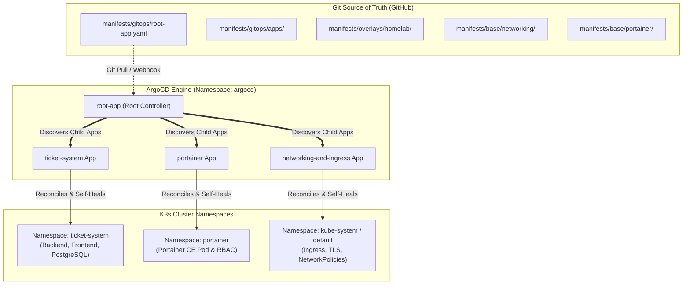
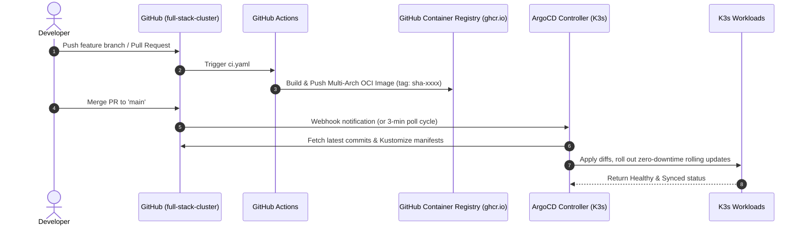

# GitOps Operations & ArgoCD Runbook

## 1. Architecture Overview: The "App of Apps" Pattern

In Phase 3, the entire cluster lifecycle is transitioned to a fully declarative **GitOps Continuous Delivery workflow** driven by [ArgoCD](https://argo-cd.readthedocs.io/).



---

## 2. Bootstrapping ArgoCD on K3s

### Step 1: Install ArgoCD Base Stack
Apply the declarative ArgoCD base installation:
```bash
kubectl apply -k manifests/base/argocd/
```

Verify that all controller and server pods are running:
```bash
kubectl get pods -n argocd -w
```

### Step 2: Retrieve the Initial Admin Password
Extract and decode the default admin credentials:
```bash
kubectl -n argocd get secret argocd-initial-admin-secret \
  -o jsonpath="{.data.password}" | base64 -d && echo
```

### Step 3: Access the Web UI
Ensure `argocd.homelab.local` points to your Laptop/Desktop node in `/etc/hosts`:
```bash
# Example /etc/hosts entry
100.x.y.z   argocd.homelab.local
```
Navigate to **`https://argocd.homelab.local`** and log in with username `admin` and the retrieved password.

---

## 3. Deploying the Root Application

To initialize automated discovery and synchronization for all cluster workloads, apply the root application manifest:

```bash
kubectl apply -f manifests/gitops/root-app.yaml
```

Once applied:
1. `root-app` reads all child applications defined in `manifests/gitops/apps/`.
2. ArgoCD provisions `ticket-system`, `portainer`, and `networking-and-ingress`.
3. Automatic **Self-Healing** (`automated.selfHeal=true`) and **Pruning** (`automated.prune=true`) ensure that any manual out-of-band edits (`kubectl edit`, accidental deletions) are immediately reverted back to the Git state.

---

## 4. End-to-End GitOps Development Lifecycle



---

## 5. Disaster Recovery & Cluster Rebuilding

In the event of total hardware loss or cluster re-installation:
1. Re-install K3s on bare-metal using `config/k3s/config.yaml.example`.
2. Re-apply secrets:
   ```bash
   kubectl apply -f manifests/secrets.yaml
   ```
3. Install ArgoCD:
   ```bash
   kubectl apply -k manifests/base/argocd/
   ```
4. Restore all services in a single command:
   ```bash
   kubectl apply -f manifests/gitops/root-app.yaml
   ```
The entire microservice suite, ingress rules, network policies, and administrative tools will self-assemble within 60 seconds.

