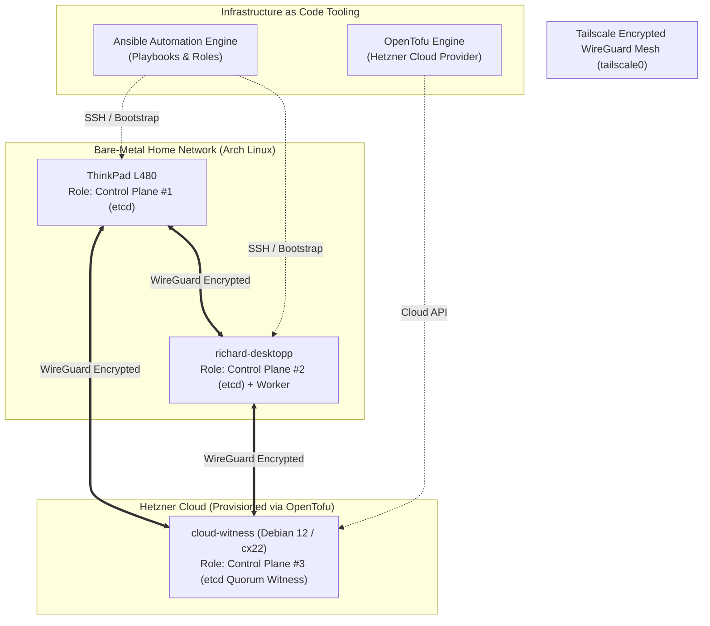

# Infrastructure as Code (IaC) & Bare-Metal Provisioning Runbook

## 1. Architecture Overview: Hybrid High-Availability Topography

In Phase 5, cluster bootstrapping is fully automated from bare-metal hardware up to a **3-node quorum High-Availability (HA) Control Plane** spanning home endpoints and a lightweight cloud witness.



---

## 2. Step-by-Step Provisioning Guide

### Step 1: Provision the Cloud Witness Node (OpenTofu)
The cloud witness guarantees an odd number of voting members ($2N+1 = 3$), ensuring that the failure or sleep-mode of the Laptop or Desktop never compromises the `etcd` cluster quorum.

```bash
cd infrastructure/opentofu

# 1. Copy and configure variables
cp terraform.tfvars.example terraform.tfvars
nano terraform.tfvars

# 2. Initialize and apply OpenTofu
tofu init
tofu plan
tofu apply -auto-approve
```

---

### Step 2: Bootstrap Bare-Metal Nodes (Ansible)
Ansible idempotently configures the Linux kernel parameters, WireGuard routing, DNS loopback bypass, and installs K3s with embedded etcd.

```bash
cd ../ansible

# 1. Configure inventory and variables
cp inventory/hosts.ini.example inventory/hosts.ini
cp group_vars/all.yaml.example group_vars/all.yaml
nano inventory/hosts.ini
nano group_vars/all.yaml

# 2. Execute full cluster provisioning
ansible-playbook -i inventory/hosts.ini playbooks/site.yaml
```

---

## 3. Quorum & High Availability Verification

Verify that all three nodes are healthy and actively participating in the control plane:

```bash
# 1. Check all nodes in Kubernetes API
kubectl get nodes -o wide

# Expected output:
# NAME              STATUS   ROLES                       VERSION
# thinkpad-master   Ready    control-plane,etcd,master   v1.30.3+k3s1
# desktop-worker    Ready    control-plane,etcd,worker   v1.30.3+k3s1
# cloud-witness     Ready    control-plane,etcd          v1.30.3+k3s1

# 2. Check embedded etcd cluster health
kubectl -n kube-system exec -it $(kubectl get pods -n kube-system -l component=etcd -o jsonpath='{.items[0].metadata.name}') -- etcdctl endpoint health
```

---

## 4. 10-Minute Disaster Recovery Blueprint

If all physical hardware is replaced or destroyed:
1. **Cloud Provisioning (2 min):** Run `tofu apply` in `infrastructure/opentofu/`.
2. **OS & K3s Bootstrapping (4 min):** Run `ansible-playbook` in `infrastructure/ansible/`.
3. **Secrets Injection (1 min):** Apply `kubectl apply -f manifests/secrets.yaml`.
4. **GitOps Auto-Assembly (2 min):** Run `kubectl apply -f manifests/gitops/root-app.yaml`.

Within **10 minutes**, the entire distributed architecture—including ingress, zero-trust tunnels, replicated storage, databases, and microservices—is restored to full operation.

