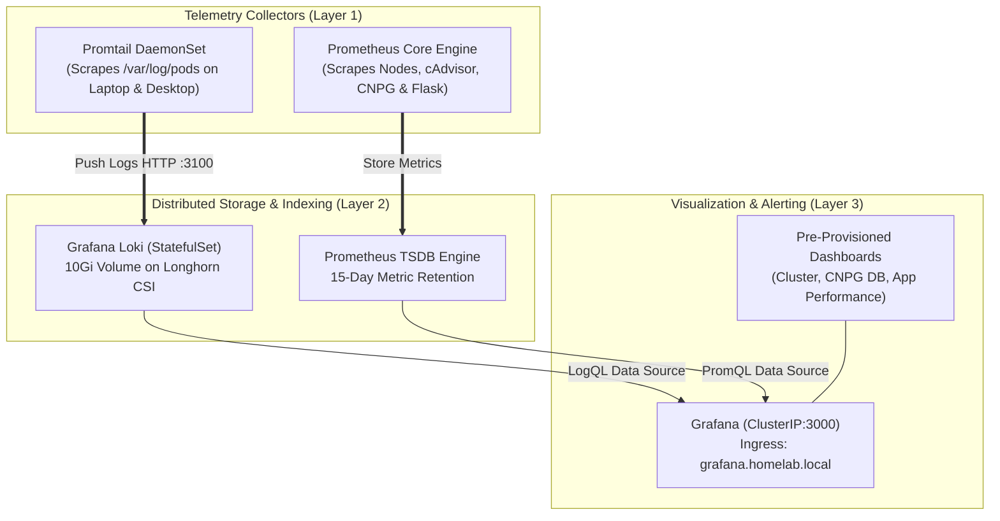

# Full-Stack Observability & SRE Runbook

## 1. Observability Architecture (LGTM Stack)

Phase 6 completes the enterprise transformation by deploying the **LGTM Telemetry Stack** (Prometheus, Grafana, Loki, Promtail) across our hybrid bare-metal K3s topology.



---

## 2. Accessing Telemetry Dashboards

Ensure `grafana.homelab.local` points to your Master/Worker Tailscale IP in `/etc/hosts`:

```bash
# Example /etc/hosts entry
100.x.y.z   grafana.homelab.local
```

* **Web UI Endpoint:** `https://grafana.homelab.local`
* **Default Credentials:** Username: `admin` / Password: `admin`

---

## 3. PromQL Metrics Query Cheat Sheet

### 1. Tailscale Mesh Network Bandwidth:
```promql
rate(node_network_receive_bytes_total{device="tailscale0"}[5m])
rate(node_network_transmit_bytes_total{device="tailscale0"}[5m])
```

### 2. Physical Node CPU & Memory Utilization:
```promql
# CPU Utilization (%)
100 - (avg by (instance) (rate(node_cpu_seconds_total{mode="idle"}[5m])) * 100)

# Memory Utilization (%)
100 * (1 - (node_memory_MemAvailable_bytes / node_memory_MemTotal_bytes))
```

### 3. CloudNativePG PostgreSQL Replication Lag:
```promql
cnpg_replication_lag_bytes{datname="ticket_db"}
```

### 4. Flask Application HTTP Error Rates:
```promql
sum(rate(flask_http_request_total{status=~"5.."}[5m])) / sum(rate(flask_http_request_total[5m])) * 100
```

---

## 4. LogQL Centralized Logging Cheat Sheet (Grafana Explore)

### 1. Stream all logs from the Incident Ticket System:
```logql
{namespace="ticket-system"}
```

### 2. Filter exclusively for Backend API Exceptions:
```logql
{namespace="ticket-system", container="flask-api"} |= "ERROR"
```

### 3. Track CloudNativePG PostgreSQL Failover & Leader Election Events:
```logql
{namespace="ticket-system"} |= "promoted" or "failover"
```

### 4. Monitor Ingress HTTP Access Logs:
```logql
{namespace="kube-system", container="traefik"} | json | status >= 500
```

---

## 5. SRE Incident Triage Runbook

```mermaid
flowchart TD
    ALERT[Alert Triggered or Incident Reported] --> CHECK_GRAFANA{Inspect Grafana Dashboards}
    
    CHECK_GRAFANA -->|High CPU / Memory| POD_RESOURCES[Check Pod resource limits & scale replicas in Kustomize overlay]
    CHECK_GRAFANA -->|Network Timeouts| CHECK_MTU{Check Tailscale vs Flannel MTU}
    
    CHECK_MTU -->|Packet drops observed| MTU_REMEDY[Verify config.yaml contains MTU 1230]
    CHECK_MTU -->|No packet drops| QUERY_LOKI[Query Loki in Explore: {namespace='ticket-system'} |= 'Exception']
    
    QUERY_LOKI --> FIX_APP[Debug backend / database connection pool & release bugfix via GitOps]
```

